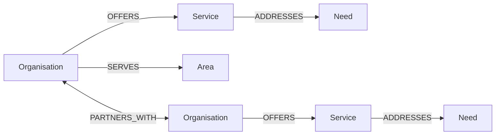
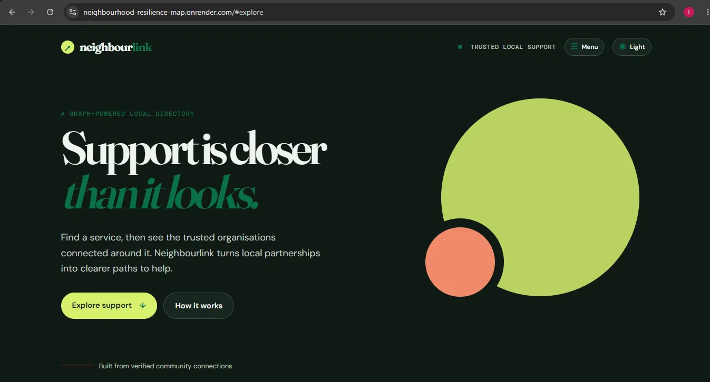
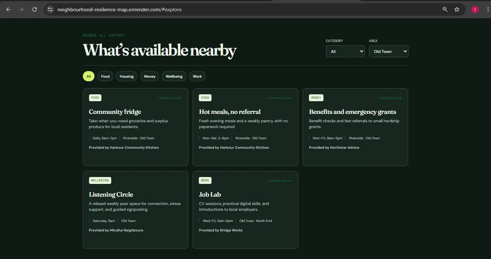
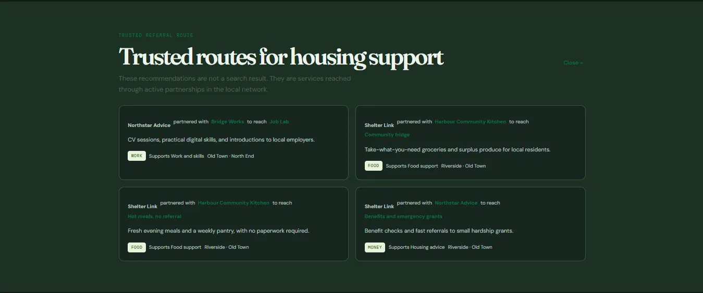

# Neighbourhood Resilience Map

Neighbourlink is a graph-powered directory for finding local help through the relationships between community organisations. A visitor can browse support services by category and area, or start with a need and follow a trusted referral route through organisations that already partner with one another.

> Built for the WEXA AI CognoDB take-home assignment.

## Demo

- **Live app:** https://neighbourhood-resilience-map.onrender.com/
- **Walkthrough video:** [Watch here](https://drive.google.com/file/d/19QziYaYnh959Tt3g4dtqM_J_Lom9Z036/view)


## Why a graph database?

A normal directory answers “which services match this category?” Neighbourlink also needs to answer “which **trusted** services can a resident reach through the partner network around an initial point of support?” That is relationship-first data.

The key interaction follows a four-hop route:

`Need <-[:ADDRESSES]- Service <-[:OFFERS]- Organisation -[:PARTNERS_WITH]- Organisation -[:OFFERS]-> Service`

In a relational schema, this becomes a brittle series of self-joins across organisation, service, coverage, and partnership tables. In Cypher, the route is explicit, naturally variable in depth, and easy to constrain to a resident’s area. As partnerships evolve, the query works without redesigning a join table chain.

## Data model



| Node | Important properties |
| --- | --- |
| `Organisation` | `id`, `name`, `kind`, `verified` |
| `Service` | `id`, `name`, `category`, `description`, `availability` |
| `Need` | `slug`, `name` |
| `Area` | `name` |

All nodes use stable unique identifiers. Relationships express the actual local network: an organisation offers a service, serves an area, and partners with other organisations.

## Main graph queries

- **Browse services** uses `Organisation -> Service` and optional `Organisation -> Area` paths; it takes `category` and `area` as parameters.
- **Trusted referral routes** uses the four-hop traversal above to move from a selected need through the provider’s partner network to a recommended service. This is the graph-native part of the product: it reveals useful second-degree connections, not only direct listings.
- Every query is declared in [`src/queries.js`](src/queries.js) and passed to the official `neo4j-driver` with a parameter object. No Cypher is concatenated from user input.

## Run locally

### 1. Create CognoDB instance

1. Create a free account at [CognoDB Cloud](https://console.cognodb.com/signup).
2. Create a free `c0` instance and copy its generated password (it is only shown once).
3. Copy `.env.example` to `.env` and set the connection URI and password:

```env
COGNODB_URI=bolt+s://your-instance-id.databases.cognodb.cloud
COGNODB_USERNAME=cognodb
COGNODB_PASSWORD=your-generated-password
```

### 2. Install, seed, and start

```bash
npm install
npm run seed
npm run verify
npm start
```

Open [http://localhost:3000](http://localhost:3000).

The seed script is safe to run repeatedly: it uses `MERGE` on stable IDs, creates four uniqueness constraints, and loads 5 organisations, 6 services, 4 support needs, 3 areas, service coverage, and partnerships.

`npm run verify` is a small post-seed check that confirms the database contains the expected graph (at least 18 nodes and 26 relationships). `npm run check` runs syntax checks for the server, client, and scripts.

## Architecture

```text
public/             Responsive single-page client
src/config.js       Environment-only configuration
src/db.js           Official Neo4j driver lifecycle and read/write helpers
src/queries.js      Parameterised Cypher queries
src/repository.js   Small data-access layer
src/server.js       Express API, static serving, error boundary
scripts/seed.js     Idempotent graph seed script
```

The browser only calls a small REST API. The server owns the database driver and secrets; the client never sees database credentials. Missing configuration, driver failures, or unreachable instances produce a clear `503` response and a friendly in-app error state.

## UI notes

The interface is designed for a resident rather than a graph database user: it starts with human language (“What do you need?”), makes verification visible, keeps filters lightweight, and explains why a referral is relevant. It includes loading, empty, and unavailable states, plus a persistent light/dark theme control for readability.

## Screenshots

**Homepage**



**Populated directory**



**Trusted referral route**



## Deployment and recording checklist

1. Push this folder to a new GitHub repository. Do not commit `.env`.
2. Deploy on a Node-compatible free service such as Render, Railway, or Fly.io, adding `COGNODB_URI`, `COGNODB_USERNAME`, and `COGNODB_PASSWORD` in its environment settings. A ready-to-use `render.yaml` is included for Render.
3. Capture two screenshots: the populated directory and a trusted referral route. Add them under `docs/screenshots/` and embed them here before submitting.
4. Record a 60-90 second walkthrough: choose a need, show a referral route, filter services, and point out the four-hop graph query in `src/queries.js`.

For the complete pre-submission and recording script, see [`docs/SUBMISSION_CHECKLIST.md`](docs/SUBMISSION_CHECKLIST.md).

## Trade-offs / next steps

This deliberately uses a small, understandable seed network for the free tier. In production I would add organisation-managed verification, service freshness timestamps, accessibility/language fields, and an anonymised feedback signal on whether a referral led to successful support.
